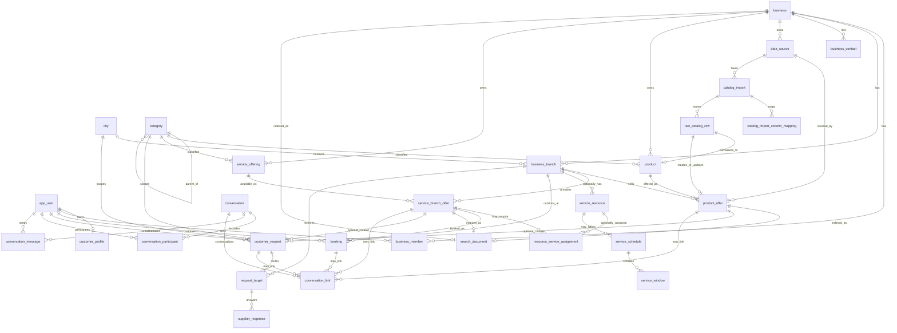

# Product And Service Foundation ERD

This document defines the MVP database foundation for products, services, search, fallback requests, booking, and messaging.

## Decision Summary

- Keep `definition vs offer`: searchable real-world results are branch-level offers, not abstract definitions.
- Keep `business_branch`: customers must see the concrete branch that can provide the product or service.
- Keep `search_document`: product offers, service branch offers, and businesses are indexed through one searchable surface.
- Keep `data_source`, `catalog_import`, and `raw_catalog_row`: imports must preserve raw supplier data and normalize it into searchable offers.
- Keep `customer_request` as fallback: requests are created when search data is missing, stale, low-confidence, or confirmation-needed.
- Add `booking`: a confirmed service slot is not the same as a fallback request.
- Add universal `conversation`: chat must not be permanently tied only to request flow.
- Simplify product MVP: one concrete variation is one `product`; search grouping is handled by tags and search documents, not variant tables.
- Defer `product_variant`, `product_attribute_definition`, `product_variant_attribute_value`, and availability history snapshots until a real business case requires them.

## System Analysis

Problem:
Build a product and service foundation that supports accurate local search without pretending Ask has stock, schedule, or booking truth that suppliers did not provide.

Actors:
Customer, business owner, branch manager, service provider, branch operator, Ask backend, future import/integration adapters.

Current evidence:
AskBackend foundation states that Ask is search-first, known products and services should appear before fallback requests, services are not products, catalog import is core, and data truth must be explicit.

Proposed model:
Use shared business and branch ownership, concrete product rows with tags, branch-level product offers, service offerings, branch-level service offers, optional abstract resources for scheduled services, bookings for confirmed service commitments, universal conversations, and search documents over real searchable surfaces.

MVP shortcut:
Treat each product variation as a separate concrete product. Use `tags` and `search_document` text to make queries like `Mammut 5kg Chocolate` exact enough without adding Shopify-style variants.

Deferred decisions:
Product variant management, attribute definitions, inventory history snapshots, resource UI, specialist accounts, real provider integrations, and full booking payment flows.

Risks:
Adding specialists too early can expand service scope. Adding product variants too early can turn MVP catalog into e-commerce back office. Treating requests as bookings can create false availability promises.

Verification:
Review table ownership, foreign keys, search indexing inputs, state transitions, and data-truth fields. Do not create tests for this project unless the rule is explicitly reversed.

## Entity Groups

### Shared

- `app_user`: authentication identity for customers, business owners, and staff.
- `customer_profile`: customer-facing profile data for an `app_user`.
- `business`: legal or commercial business account.
- `business_member`: user membership inside a business.
- `business_branch`: concrete physical or service branch shown in search results.
- `business_contact`: branch or business contact channels.
- `city`: city scope for search, branches, and requests.
- `category`: search/navigation taxonomy for products and services.
- `data_source`: source of supplier data such as manual entry, Excel, CSV, POS, CRM, or future provider adapter.

### Product Catalog

- `product`: one concrete sellable item, including concrete variations as separate products.
- `catalog_import`: one supplier import run.
- `catalog_import_column_mapping`: supplier file column mapping for a catalog import.
- `raw_catalog_row`: preserved raw supplier row from import.
- `product_offer`: concrete branch-level offer for one product.

### Services

- `service_offering`: service definition owned by a business.
- `service_branch_offer`: concrete branch-level availability surface for a service.
- `service_resource`: optional abstract capacity resource for scheduled services only.
- `resource_service_assignment`: optional link between a resource and service branch offer.
- `service_schedule`: optional schedule for a resource or branch-level scheduled service.
- `service_window`: available or blocked time window for scheduled service logic.
- `booking`: confirmed or pending booking lifecycle for a service branch offer.

### Search And Fallback

- `search_document`: normalized searchable surface for product offers, service branch offers, and businesses.
- `customer_request`: fallback request created when search cannot confidently answer.
- `request_target`: branch selected to receive a fallback request.
- `supplier_response`: branch response to a request target.

### Messaging

- `conversation`: universal chat thread.
- `conversation_participant`: users and business-side participants in a conversation.
- `conversation_message`: message inside a conversation.
- `conversation_link`: optional link from a conversation to request, booking, product offer, or service branch offer context.

## MVP Table Shape

### `product`

- `id`
- `business_id`
- `category_id`
- `name`
- `description`
- `tags`
- `sku`
- `status`
- `created_at`
- `updated_at`

Concrete examples:

- `Mammut protein 5kg Chocolate`
- `Mammut protein 1kg Strawberry`
- `Mammut protein 5kg Vanilla`

`Mammut protein` is search language, not a mandatory database parent. All three products can share tags such as `mammut`, `protein`, and `sports nutrition`.

### `product_offer`

- `id`
- `product_id`
- `branch_id`
- `data_source_id`
- `price`
- `stock_status`
- `stock_quantity`
- `availability_confidence`
- `freshness_at`
- `status`
- `created_at`
- `updated_at`

`stock_quantity` is nullable. It can be shown only when supplier input or an integration provides it. Otherwise `stock_status` and `availability_confidence` should drive confirmation-needed behavior.

### `service_branch_offer`

- `id`
- `service_offering_id`
- `branch_id`
- `service_mode`
- `base_price`
- `duration_minutes`
- `availability_confidence`
- `confirmation_policy`
- `status`
- `created_at`
- `updated_at`

`service_mode` should distinguish at least:

- `ON_DEMAND`: can exist without resource assignment, schedule, or windows.
- `SCHEDULED`: may use resource assignment, schedule, windows, and booking.

### `service_resource`

- `id`
- `branch_id`
- `name`
- `resource_type`
- `status`
- `created_at`
- `updated_at`

This is an abstract capacity resource only. It can represent a room, chair, equipment, or unnamed staff capacity. It must not imply specialist login, specialist UI, payroll, or user-managed employee profiles in MVP.

### `booking`

- `id`
- `customer_id`
- `service_branch_offer_id`
- `branch_id`
- `conversation_id`
- `status`
- `requested_start_at`
- `confirmed_start_at`
- `confirmed_end_at`
- `source`
- `customer_note`
- `provider_note`
- `created_at`
- `updated_at`

Lifecycle:

```text
PENDING -> CONFIRMED -> COMPLETED
PENDING -> CANCELLED
CONFIRMED -> CANCELLED
```

Bookings must only reserve real time when the branch confirms it or a trusted schedule/integration provides it.

## ERD



## Database Connections

### Shared

- `customer_profile.user_id -> app_user.id`
- `business_member.user_id -> app_user.id`
- `business_member.business_id -> business.id`
- `business_branch.business_id -> business.id`
- `business_branch.city_id -> city.id`
- `business_contact.business_id -> business.id`
- `business_contact.branch_id -> business_branch.id`
- `category.parent_id -> category.id`
- `data_source.business_id -> business.id`

### Product

- `product.business_id -> business.id`
- `product.category_id -> category.id`
- `catalog_import.data_source_id -> data_source.id`
- `catalog_import_column_mapping.catalog_import_id -> catalog_import.id`
- `raw_catalog_row.catalog_import_id -> catalog_import.id`
- `raw_catalog_row.product_id -> product.id`
- `raw_catalog_row.product_offer_id -> product_offer.id`
- `product_offer.product_id -> product.id`
- `product_offer.branch_id -> business_branch.id`
- `product_offer.data_source_id -> data_source.id`

### Service

- `service_offering.business_id -> business.id`
- `service_offering.category_id -> category.id`
- `service_branch_offer.service_offering_id -> service_offering.id`
- `service_branch_offer.branch_id -> business_branch.id`
- `service_resource.branch_id -> business_branch.id`
- `resource_service_assignment.resource_id -> service_resource.id`
- `resource_service_assignment.service_branch_offer_id -> service_branch_offer.id`
- `service_schedule.resource_id -> service_resource.id`
- `service_window.schedule_id -> service_schedule.id`
- `booking.customer_id -> app_user.id`
- `booking.service_branch_offer_id -> service_branch_offer.id`
- `booking.branch_id -> business_branch.id`
- `booking.conversation_id -> conversation.id`

### Search And Request Fallback

- `search_document.product_offer_id -> product_offer.id`
- `search_document.service_branch_offer_id -> service_branch_offer.id`
- `search_document.business_id -> business.id`
- `customer_request.user_id -> app_user.id`
- `customer_request.city_id -> city.id`
- `customer_request.category_id -> category.id`
- `customer_request.product_offer_id -> product_offer.id`
- `customer_request.service_branch_offer_id -> service_branch_offer.id`
- `request_target.customer_request_id -> customer_request.id`
- `request_target.branch_id -> business_branch.id`
- `supplier_response.request_target_id -> request_target.id`

### Messaging

- `conversation_participant.conversation_id -> conversation.id`
- `conversation_participant.user_id -> app_user.id`
- `conversation_participant.business_id -> business.id`
- `conversation_participant.branch_id -> business_branch.id`
- `conversation_message.conversation_id -> conversation.id`
- `conversation_message.sender_user_id -> app_user.id`
- `conversation_link.conversation_id -> conversation.id`
- `conversation_link.customer_request_id -> customer_request.id`
- `conversation_link.booking_id -> booking.id`
- `conversation_link.product_offer_id -> product_offer.id`
- `conversation_link.service_branch_offer_id -> service_branch_offer.id`

## Search Logic

Product search should index from `product_offer`, joining:

- `product.name`
- `product.description`
- `product.tags`
- `category.name`
- `business.name`
- `business_branch.name`
- `business_branch.city_id`
- `product_offer.price`
- `product_offer.stock_status`
- `product_offer.availability_confidence`
- `product_offer.freshness_at`

For the query `Mammut 5kg Chocolate`, exact matching comes from product name, tags, and normalized search document tokens. Variant tables are not required for search accuracy when each sellable variation is already a concrete product.

Service search should index from `service_branch_offer`, joining:

- `service_offering.name`
- `service_offering.description`
- `category.name`
- `business.name`
- `business_branch.name`
- `service_branch_offer.service_mode`
- `service_branch_offer.duration_minutes`
- `service_branch_offer.availability_confidence`
- `service_branch_offer.confirmation_policy`

Fallback request creation should be allowed when:

- no search document matches;
- matching data is stale;
- confidence is low;
- product stock is unknown;
- service slot availability is confirmation-needed;
- customer wants supplier confirmation.

Booking creation should be allowed only when:

- the selected service branch offer supports booking;
- the branch confirms the time manually; or
- a future trusted schedule/integration confirms the time.

## MVP Deferrals

Do not implement these in MVP:

- `product_variant`
- `product_attribute_definition`
- `product_variant_attribute_value`
- `product_alias`
- `product_offer_availability` snapshot history
- specialist user accounts
- specialist-facing UI
- automatic slot guarantees without trusted schedule or integration data

Future migration can add variant tables if a real supplier needs parent product management, option selection UI, and separate stock per option combination.
