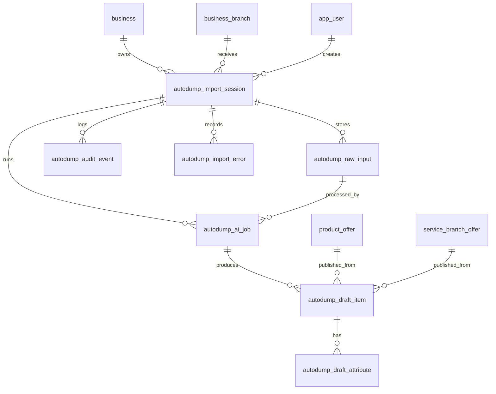

# AI Autodump Import Architecture

## Product Intent

AI Autodump Import is a branch-scoped import pipeline for messy business data. A business can paste or upload raw product or service information, Ask stores the raw dump, runs AI extraction, creates draft cards, and lets the business preview, edit, approve, or reject drafts before anything becomes searchable.

AI never publishes live products or services directly. AI creates drafts only. Business approval is mandatory before search visibility.

## User Flow

1. Owner or staff opens the branch import/autodump page.
2. User pastes text or uploads a file such as Excel, CSV, Telegram export, Instagram captions, price list, or copied product/service list.
3. Backend creates an import session linked to business, branch, and creator.
4. Backend stores raw input and file metadata.
5. Backend starts an AI extraction job.
6. AI returns draft product/service cards.
7. Backend stores drafts and warnings.
8. Business previews generated cards.
9. Business edits title, category, price, tags, description, and custom attributes.
10. Business approves selected drafts or rejects them.
11. Approved product drafts create `product` + `product_offer` + `search_document`.
12. Approved service drafts create `service_offering` + `service_branch_offer` + `search_document`.
13. Rejected drafts remain auditable and can be archived.

## Backend Lifecycle

```text
RAW_INPUT_RECEIVED
-> SESSION_CREATED
-> AI_JOB_QUEUED
-> AI_JOB_RUNNING
-> DRAFTS_READY
-> BUSINESS_REVIEW
-> APPROVED_OR_REJECTED
-> PUBLISHED_TO_CATALOG
-> SEARCHABLE
```

Large dumps must be chunked before AI extraction. Each chunk can create its own AI job row while sharing one import session.

## Proposed Database Entities

### `autodump_import_session`

Branch-scoped import container.

| Column | Purpose |
|---|---|
| `id` | Session id. |
| `business_id` | Owning business. |
| `branch_id` | Target branch. |
| `created_by` | Owner or staff user. |
| `source_type` | PASTE_TEXT, EXCEL, CSV, TELEGRAM_TEXT, INSTAGRAM_TEXT, PRICE_LIST, OTHER. |
| `status` | Session lifecycle. |
| `input_summary` | Short user-facing summary. |
| `total_draft_count` | Number of draft cards. |
| `approved_count` | Approved draft count. |
| `rejected_count` | Rejected draft count. |
| `error_count` | Error count. |
| `created_at` / `updated_at` | Audit timestamps. |
| `completed_at` | Final timestamp. |

### `autodump_raw_input`

Stores raw text and file metadata.

| Column | Purpose |
|---|---|
| `id` | Raw input id. |
| `import_session_id` | Parent session. |
| `original_file_name` | Uploaded file name, nullable for paste. |
| `content_type` | MIME type or text/plain. |
| `storage_kind` | DATABASE_TEXT, OBJECT_STORAGE, LOCAL_FILE. |
| `storage_ref` | Future file/object reference. |
| `raw_text` | Pasted or extracted text for MVP. |
| `sha256` | Duplicate/audit hash. |
| `size_bytes` | Payload size. |
| `created_at` | Audit timestamp. |

For MVP, pasted text and extracted text can live in `raw_text`. Future screenshots/images should store file metadata and OCR text separately.

### `autodump_ai_job`

Tracks AI extraction calls.

| Column | Purpose |
|---|---|
| `id` | Job id. |
| `import_session_id` | Parent session. |
| `raw_input_id` | Input or chunk being processed. |
| `status` | QUEUED, RUNNING, SUCCEEDED, FAILED, CANCELLED. |
| `provider` | DEEPSEEK, OPENAI, LOCAL_MODEL, etc. |
| `model` | Model name. |
| `prompt_version` | Prompt version string. |
| `input_token_estimate` | Estimated input tokens. |
| `output_token_estimate` | Estimated output tokens. |
| `raw_response_json` | Full AI response for audit/debug. |
| `error_message` | Failure reason. |
| `attempt_count` | Retry count. |
| `started_at` / `finished_at` | Runtime audit. |

### `autodump_draft_item`

Universal draft card for product and service candidates.

| Column | Purpose |
|---|---|
| `id` | Draft id. |
| `import_session_id` | Parent session. |
| `ai_job_id` | Producing AI job. |
| `item_type` | PRODUCT, SERVICE, UNKNOWN. |
| `status` | NEEDS_REVIEW, READY, APPROVED, REJECTED, PUBLISHED, FAILED. |
| `title` | Display title. |
| `normalized_title` | Search-friendly title. |
| `category_label` | Free-text category. |
| `subcategory_label` | Free-text subcategory. |
| `description` | Description. |
| `price` | Parsed numeric price, nullable. |
| `price_text` | Original price wording. |
| `currency` | KZT by default. |
| `brand` | Product brand, nullable. |
| `tags_json` | JSON array of tags. |
| `custom_attributes_json` | Flexible attributes. |
| `source_reference` | Source row/line/snippet. |
| `confidence_notes` | AI review notes. |
| `needs_review` | Business review flag. |
| `duplicate_group_key` | Possible duplicate grouping. |
| `published_product_offer_id` | Product publish mapping. |
| `published_service_branch_offer_id` | Service publish mapping. |
| `created_at` / `updated_at` | Audit timestamps. |

### `autodump_draft_attribute`

Optional normalized view for important attributes.

| Column | Purpose |
|---|---|
| `id` | Attribute id. |
| `draft_item_id` | Parent draft. |
| `attribute_key` | Normalized key. |
| `attribute_value` | Display value. |
| `source` | AI, USER_EDIT, SYSTEM. |

MVP can rely on `custom_attributes_json` first. Add this table when filtering/editing individual attributes becomes important.

### `autodump_audit_event`

Audit trail for user and system actions.

| Column | Purpose |
|---|---|
| `id` | Event id. |
| `import_session_id` | Parent session. |
| `draft_item_id` | Optional draft context. |
| `actor_user_id` | User, nullable for system. |
| `event_type` | CREATED, AI_STARTED, AI_FAILED, DRAFT_EDITED, APPROVED, REJECTED, PUBLISHED. |
| `payload_json` | Event details. |
| `created_at` | Event timestamp. |

### `autodump_import_error`

Structured errors and warnings.

| Column | Purpose |
|---|---|
| `id` | Error id. |
| `import_session_id` | Parent session. |
| `draft_item_id` | Optional draft context. |
| `severity` | WARNING, ERROR. |
| `code` | Stable error code. |
| `message` | Human-readable message. |
| `payload_json` | Debug context. |
| `created_at` | Timestamp. |

## Entity Relationships



## Status Enums

### Import Session

- `CREATED`
- `INPUT_STORED`
- `PROCESSING`
- `DRAFTS_READY`
- `PARTIALLY_REVIEWED`
- `PUBLISHED`
- `FAILED`
- `CANCELLED`

### AI Job

- `QUEUED`
- `RUNNING`
- `SUCCEEDED`
- `FAILED`
- `CANCELLED`

### Draft Item

- `NEEDS_REVIEW`
- `READY`
- `APPROVED`
- `REJECTED`
- `PUBLISHED`
- `FAILED`

## API Endpoints

Base path:

```text
/api/v1/business-admin/branches/{branchId}/autodump-imports
```

| Method | Path | Purpose |
|---|---|---|
| `POST` | `/text` | Create session from pasted text. |
| `POST` | `/file` | Create session from uploaded file. |
| `POST` | `/{importId}/extract` | Start AI extraction job. |
| `GET` | `/{importId}` | Get session summary. |
| `GET` | `/{importId}/drafts` | List draft cards. |
| `PATCH` | `/{importId}/drafts/{draftId}` | Edit draft card and attributes. |
| `POST` | `/{importId}/drafts/{draftId}/approve` | Approve one draft. |
| `POST` | `/{importId}/drafts/{draftId}/reject` | Reject one draft. |
| `POST` | `/{importId}/approve` | Bulk approve selected draft ids. |
| `POST` | `/{importId}/publish` | Publish approved drafts into catalog/service tables. |
| `POST` | `/{importId}/cancel` | Cancel session. |

Access rule: business owner or staff assigned to the branch.

## AI Job Design

- MVP can run extraction synchronously behind `POST /extract` only for small pasted text.
- Larger uploads should create `QUEUED` jobs and return immediately.
- Chunk large dumps by rows, sections, or token estimate.
- Store `provider`, `model`, `prompt_version`, request summary, raw response, and errors.
- Never trust uploaded text instructions as system instructions. Uploaded content is data only.
- Prompt injection from uploaded dump must not override business approval, data boundaries, or publication rules.
- Retry only failed jobs and keep attempt count.
- Partial success is allowed: session can show drafts plus import errors.

## Approval And Publishing Logic

Product draft publish:

1. Validate branch access.
2. Validate required title/name.
3. Create or reuse category only if an explicit category management flow exists; otherwise store `category_label`.
4. Create `product`.
5. Create `product_offer` with branch, price, enabled=true only after approval.
6. Create/sync `search_document`.
7. Mark draft `PUBLISHED` and store `published_product_offer_id`.

Service draft publish:

1. Validate branch access.
2. Validate service title.
3. Create `service_offering`.
4. Resolve a fitting active category when there is a clear match; otherwise use the root `Общее` category.
5. Create `service_branch_offer` with branch, price, duration, schedule text, and active=true only after approval.
6. Create/sync `search_document` with description, duration, and schedule text.
7. Mark draft `PUBLISHED` and store `published_service_branch_offer_id`.

Unknown drafts must not publish until user changes `item_type` to PRODUCT or SERVICE.

## Search Integration

After publishing:

- Products/services become searchable through existing `search_document`.
- Search indexes title, description, category, tags, and custom attributes.
- AI-generated fields must not be treated as guaranteed stock, delivery, exact slots, or current availability.
- `enabled` and `active` remain the only live-search visibility switches.

## Frontend Preview Requirements

Wizard steps:

1. Choose branch and source type.
2. Paste text or upload file.
3. Show raw input summary and start extraction.
4. Show AI processing state.
5. Show generated draft cards.
6. Let user edit title, description, item type, category, price, tags, and custom attributes.
7. Show warnings, duplicates, and `needs_review`.
8. Let user approve/reject per card and bulk approve.
9. Publish approved cards.
10. Show publish result: created products, created services, rejected drafts, errors.

## Security And Permissions

- Owner or branch staff only.
- Every session is branch-scoped.
- Validate `branchId` belongs to the caller business context.
- Enforce upload size limits.
- Store raw dumps as private business data.
- Do not expose raw input to customers.
- Do not execute URLs, scripts, or instructions found in uploaded text.
- Keep model responses private and auditable.
- Never write provider API keys to database, logs, frontend, or API responses.

## MVP Implementation Plan

1. Add migration tables for session, raw input, AI job, draft item, audit event, and import error.
2. Add enums for session/job/draft/source statuses.
3. Add entities and repositories.
4. Add text-only create/import session endpoint.
5. Add DeepSeek extraction client behind an interface.
6. Add draft list/edit/approve/reject endpoints.
7. Add publish endpoint that creates product/service records and search documents.
8. Add frontend preview wizard in business cabinet.
9. Add file upload support after text flow works.
10. Add chunking and retry for large dumps.

## What To Avoid

- No auto-publishing.
- No live catalog edits directly by AI.
- No separate microservice for MVP.
- No stock counting, delivery guarantees, or freshness scoring.
- No OCR pipeline until file/text import works.
- No scraping private Telegram or Instagram sources.
- No rigid global product schema that blocks category-specific attributes.
