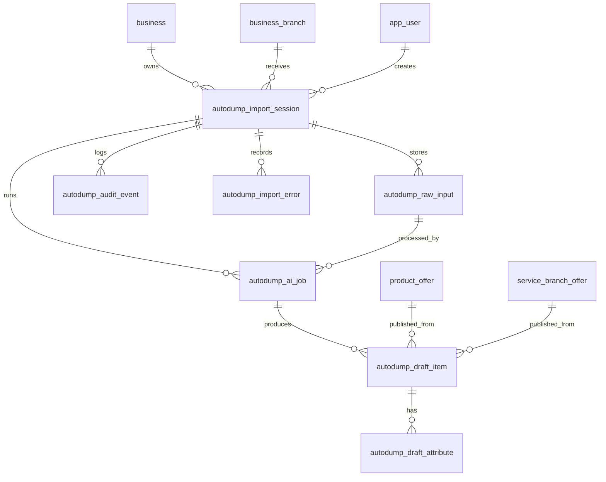

# AI Autodump Import — Actualized Architecture (Ready for Implementation)

This document actualizes `AI_AUTODUMP_IMPORT_ARCHITECTURE.md` against the real AskBackend codebase as of 2026-06-30. It adds concrete implementation details: exact package, class names, migration file naming, reuse of existing patterns (DeepSeek client, branch access control, search_document sync), and code-level decisions.

## 1. Product Intent (unchanged from spec)

AI Autodump Import is a branch-scoped import pipeline for messy business data. A business can paste or upload raw product or service information. Ask stores the raw dump, runs AI extraction, creates draft cards, and lets the business preview, edit, approve, or reject drafts before anything becomes searchable.

AI never publishes live products or services directly. AI creates drafts only. Business approval is mandatory before search visibility.

## 2. User Flow (unchanged from spec)

1. Owner or staff opens the branch import/autodump page.
2. User pastes text or uploads a file (Excel, CSV, Telegram export, Instagram captions, price list, copied product/service list).
3. Backend creates an import session linked to business, branch, and creator.
4. Backend stores raw input and file metadata.
5. Backend starts an AI extraction job.
6. AI returns draft product/service cards.
7. Backend stores drafts and warnings.
8. Business previews generated cards.
9. Business edits title, category, price, tags, description, and custom attributes.
10. Business approves selected drafts or rejects them.
11. Approved product drafts create `product` + `product_offer` + `search_document`.
12. Approved service drafts create `service_offering` + `service_branch_offer` + `search_document`.
13. Rejected drafts remain auditable and can be archived.

## 3. Package Structure

New feature package following existing convention (see `kz.ask.catalog`, `kz.ask.search`):

```
kz.ask.autodump/
  api/
    AutodumpImportController.java
    dto/
      CreateTextSessionRequest.java
      CreateTextSessionResponse.java
      CreateFileSessionResponse.java
      StartExtractionResponse.java
      ImportSessionResponse.java
      DraftItemResponse.java
      DraftItemListResponse.java
      UpdateDraftRequest.java
      ApproveResponse.java
      RejectResponse.java
      BulkApproveRequest.java
      PublishResponse.java
      CancelResponse.java
  application/
    AutodumpImportProcessor.java
  domain/
    AutodumpImportService.java          (interface)
    AutodumpImportServiceImpl.java
    AutodumpDraftService.java           (interface)
    AutodumpDraftServiceImpl.java
    AutodumpAuditService.java           (interface)
    AutodumpAuditServiceImpl.java
    dto/
      ImportSessionDto.java
      RawInputDto.java
      AiJobDto.java
      DraftItemDto.java
      DraftAttributeDto.java
      ImportErrorDto.java
      AuditEventDto.java
    entity/
      AutodumpImportSession.java
      AutodumpRawInput.java
      AutodumpAiJob.java
      AutodumpDraftItem.java
      AutodumpDraftAttribute.java
      AutodumpAuditEvent.java
      AutodumpImportError.java
    enums/
      ImportSessionStatus.java
      AiJobStatus.java
      DraftItemStatus.java
      SourceType.java
      StorageKind.java
      AuditEventType.java
      ErrorSeverity.java
  infrastructure/
    client/
      DeepSeekAutodumpClient.java       (follows DeepSeekSearchIntentStructurer pattern)
      AutodumpExtractionPrompt.java     (loads prompt from classpath)
    config/
      DeepSeekAutodumpConfig.java       (RestClient bean for autodump)
    mapper/
      AutodumpMapper.java               (entity ↔ dto mapping)
    repository/
      AutodumpImportSessionRepository.java
      AutodumpRawInputRepository.java
      AutodumpAiJobRepository.java
      AutodumpDraftItemRepository.java
      AutodumpDraftAttributeRepository.java
      AutodumpAuditEventRepository.java
      AutodumpImportErrorRepository.java
```

## 4. Database Migration

New migration: `V3__autodump_import.sql` (V1 is init, V2 is product_excel_import).

### `autodump_import_session`

```sql
CREATE TABLE autodump_import_session (
    id                UUID         NOT NULL PRIMARY KEY,
    created_at        TIMESTAMPTZ  NOT NULL,
    updated_at        TIMESTAMPTZ  NOT NULL,
    business_id       UUID         NOT NULL REFERENCES business(id),
    branch_id         UUID         NOT NULL REFERENCES business_branch(id),
    created_by        UUID         NOT NULL REFERENCES app_user(id),
    source_type       VARCHAR(50)  NOT NULL,
    status            VARCHAR(50)  NOT NULL,
    input_summary     VARCHAR(500),
    total_draft_count INTEGER      NOT NULL DEFAULT 0,
    approved_count    INTEGER      NOT NULL DEFAULT 0,
    rejected_count    INTEGER      NOT NULL DEFAULT 0,
    error_count       INTEGER      NOT NULL DEFAULT 0,
    completed_at      TIMESTAMPTZ
);
```

### `autodump_raw_input`

```sql
CREATE TABLE autodump_raw_input (
    id                 UUID         NOT NULL PRIMARY KEY,
    created_at         TIMESTAMPTZ  NOT NULL,
    updated_at         TIMESTAMPTZ  NOT NULL,
    import_session_id  UUID         NOT NULL REFERENCES autodump_import_session(id),
    original_file_name VARCHAR(500),
    content_type       VARCHAR(255),
    storage_kind       VARCHAR(50)  NOT NULL,
    storage_ref        VARCHAR(1000),
    raw_text           TEXT,
    sha256             VARCHAR(64),
    size_bytes         BIGINT
);
```

### `autodump_ai_job`

```sql
CREATE TABLE autodump_ai_job (
    id                    UUID         NOT NULL PRIMARY KEY,
    created_at            TIMESTAMPTZ  NOT NULL,
    updated_at            TIMESTAMPTZ  NOT NULL,
    import_session_id     UUID         NOT NULL REFERENCES autodump_import_session(id),
    raw_input_id          UUID         REFERENCES autodump_raw_input(id),
    status                VARCHAR(50)  NOT NULL,
    provider              VARCHAR(50),
    model                 VARCHAR(100),
    prompt_version        VARCHAR(50),
    input_token_estimate  INTEGER,
    output_token_estimate INTEGER,
    raw_response_json     TEXT,
    error_message         TEXT,
    attempt_count         INTEGER      NOT NULL DEFAULT 0,
    started_at            TIMESTAMPTZ,
    finished_at           TIMESTAMPTZ
);
```

### `autodump_draft_item`

```sql
CREATE TABLE autodump_draft_item (
    id                             UUID         NOT NULL PRIMARY KEY,
    created_at                     TIMESTAMPTZ  NOT NULL,
    updated_at                     TIMESTAMPTZ  NOT NULL,
    import_session_id              UUID         NOT NULL REFERENCES autodump_import_session(id),
    ai_job_id                      UUID         REFERENCES autodump_ai_job(id),
    item_type                      VARCHAR(20)  NOT NULL,
    status                         VARCHAR(50)  NOT NULL,
    title                          VARCHAR(500),
    normalized_title               VARCHAR(500),
    category_label                 VARCHAR(255),
    subcategory_label              VARCHAR(255),
    description                    TEXT,
    price                          NUMERIC,
    price_text                     VARCHAR(255),
    currency                       VARCHAR(10)  DEFAULT 'KZT',
    brand                          VARCHAR(255),
    tags_json                      TEXT,
    custom_attributes_json         TEXT,
    source_reference               TEXT,
    confidence_notes               TEXT,
    needs_review                   BOOLEAN      NOT NULL DEFAULT FALSE,
    duplicate_group_key            VARCHAR(255),
    published_product_offer_id     UUID         REFERENCES product_offer(id),
    published_service_branch_offer_id UUID      REFERENCES service_branch_offer(id)
);
```

### `autodump_draft_attribute` (deferred to post-MVP)

```sql
CREATE TABLE autodump_draft_attribute (
    id              UUID         NOT NULL PRIMARY KEY,
    created_at      TIMESTAMPTZ  NOT NULL,
    updated_at      TIMESTAMPTZ  NOT NULL,
    draft_item_id   UUID         NOT NULL REFERENCES autodump_draft_item(id),
    attribute_key   VARCHAR(255) NOT NULL,
    attribute_value TEXT         NOT NULL,
    source          VARCHAR(50)  NOT NULL
);
```

### `autodump_audit_event`

```sql
CREATE TABLE autodump_audit_event (
    id                 UUID         NOT NULL PRIMARY KEY,
    created_at         TIMESTAMPTZ  NOT NULL,
    import_session_id  UUID         NOT NULL REFERENCES autodump_import_session(id),
    draft_item_id      UUID         REFERENCES autodump_draft_item(id),
    actor_user_id      UUID         REFERENCES app_user(id),
    event_type         VARCHAR(50)  NOT NULL,
    payload_json       TEXT
);
```

### `autodump_import_error`

```sql
CREATE TABLE autodump_import_error (
    id                 UUID         NOT NULL PRIMARY KEY,
    created_at         TIMESTAMPTZ  NOT NULL,
    import_session_id  UUID         NOT NULL REFERENCES autodump_import_session(id),
    draft_item_id      UUID         REFERENCES autodump_draft_item(id),
    severity           VARCHAR(20)  NOT NULL,
    code               VARCHAR(100) NOT NULL,
    message            TEXT         NOT NULL,
    payload_json       TEXT
);
```

### Indexes

```sql
CREATE INDEX idx_autodump_session_branch   ON autodump_import_session(branch_id);
CREATE INDEX idx_autodump_session_status   ON autodump_import_session(business_id, status);
CREATE INDEX idx_autodump_raw_input_session ON autodump_raw_input(import_session_id);
CREATE INDEX idx_autodump_ai_job_session   ON autodump_ai_job(import_session_id);
CREATE INDEX idx_autodump_ai_job_status    ON autodump_ai_job(status);
CREATE INDEX idx_autodump_draft_session    ON autodump_draft_item(import_session_id);
CREATE INDEX idx_autodump_draft_status     ON autodump_draft_item(import_session_id, status);
CREATE INDEX idx_autodump_audit_session    ON autodump_audit_event(import_session_id);
CREATE INDEX idx_autodump_error_session    ON autodump_import_error(import_session_id);
```

## 5. Entity Relationships



## 6. Status Enums

### ImportSessionStatus

```
CREATED           — session created, raw input stored
INPUT_STORED      — raw input persisted, waiting for extraction
PROCESSING        — AI job(s) queued or running
DRAFTS_READY      — all AI jobs completed, drafts available for review
PARTIALLY_REVIEWED — some drafts approved/rejected, some pending
PUBLISHED         — approved drafts published to catalog/service tables
FAILED            — fatal error, no drafts produced
CANCELLED         — user cancelled before publishing
```

### AiJobStatus

```
QUEUED     — job created, not yet started
RUNNING    — API call in progress
SUCCEEDED  — extraction completed, drafts stored
FAILED     — API error, timeout, or bad response
CANCELLED  — cancelled by user or system
```

### DraftItemStatus

```
NEEDS_REVIEW — AI flagged this draft as uncertain (needs_review=true)
READY        — AI is confident, ready for business review
APPROVED     — business approved, waiting for publish
REJECTED     — business rejected
PUBLISHED    — published to catalog/service tables
FAILED       — extraction failed for this specific item
```

### SourceType

```
PASTE_TEXT, EXCEL, CSV, TELEGRAM_TEXT, INSTAGRAM_TEXT, PRICE_LIST, OTHER
```

### StorageKind

```
DATABASE_TEXT   — raw_text column used (MVP for paste and small files)
OBJECT_STORAGE  — future S3/MinIO reference via storage_ref
```

### AuditEventType

```
SESSION_CREATED, INPUT_STORED, AI_STARTED, AI_SUCCEEDED, AI_FAILED,
DRAFT_CREATED, DRAFT_EDITED, DRAFT_APPROVED, DRAFT_REJECTED,
DRAFTS_PUBLISHED, SESSION_CANCELLED
```

### ErrorSeverity

```
WARNING — non-blocking issue (bad price parse, unknown category)
ERROR    — blocking issue (AI call failed, invalid response format)
```

## 7. API Endpoints

Base path: `/api/v1/business-admin/branches/{branchId}/autodump-imports`

Access: `verifyBranchAccess()` — owner of business OR staff of branch (same pattern as `ProductImportProcessor`).

| Method | Path | Purpose | Auth |
|--------|------|---------|------|
| `POST` | `/text` | Create session from pasted text, auto-start AI extraction | Owner/Staff |
| `POST` | `/file` | Create session from uploaded file (multipart) | Owner/Staff |
| `POST` | `/{importId}/extract` | Start/re-trigger AI extraction for existing session | Owner/Staff |
| `GET` | `/{importId}` | Get session summary with counts and status | Owner/Staff |
| `GET` | `/{importId}/drafts` | List draft cards (filterable by status) | Owner/Staff |
| `GET` | `/{importId}/drafts/{draftId}` | Get single draft with attributes | Owner/Staff |
| `PATCH` | `/{importId}/drafts/{draftId}` | Edit draft fields and custom attributes | Owner/Staff |
| `POST` | `/{importId}/drafts/{draftId}/approve` | Approve one draft | Owner/Staff |
| `POST` | `/{importId}/drafts/{draftId}/reject` | Reject one draft | Owner/Staff |
| `POST` | `/{importId}/approve` | Bulk approve selected draft ids | Owner/Staff |
| `POST` | `/{importId}/publish` | Publish all approved drafts to catalog/service | Owner/Staff |
| `POST` | `/{importId}/cancel` | Cancel entire session | Owner/Staff |

### Controller signature pattern (following CatalogImportController):

```java
@RestController
@RequestMapping("/api/v1/business-admin/branches/{branchId}/autodump-imports")
@RequiredArgsConstructor
public class AutodumpImportController {

    private final AutodumpImportProcessor processor;

    @PostMapping("/text")
    public ResponseEntity<CreateTextSessionResponse> createFromText(
            @AuthenticationPrincipal AskPrincipal principal,
            @PathVariable UUID branchId,
            @Valid @RequestBody CreateTextSessionRequest request) {
        return ResponseEntity.status(HttpStatus.CREATED)
                .body(processor.createFromText(principal, branchId, request));
    }

    @PostMapping(value = "/file", consumes = MediaType.MULTIPART_FORM_DATA_VALUE)
    public ResponseEntity<CreateFileSessionResponse> createFromFile(
            @AuthenticationPrincipal AskPrincipal principal,
            @PathVariable UUID branchId,
            @RequestParam("file") MultipartFile file) {
        return ResponseEntity.status(HttpStatus.CREATED)
                .body(processor.createFromFile(principal, branchId, file));
    }

    @PostMapping("/{importId}/extract")
    public ResponseEntity<StartExtractionResponse> startExtraction(
            @AuthenticationPrincipal AskPrincipal principal,
            @PathVariable UUID branchId,
            @PathVariable UUID importId) {
        return ResponseEntity.ok(processor.startExtraction(principal, branchId, importId));
    }

    // ... remaining endpoints follow the same pattern
}
```

## 8. AI Job Design

### Client pattern (reuses DeepSeekSearchIntentStructurer approach):

```java
@Component
@RequiredArgsConstructor
public class DeepSeekAutodumpClient implements AutodumpExtractionClient {

    private static final String CHAT_COMPLETIONS_PATH = "/chat/completions";

    private final RestClient deepSeekAutodumpRestClient;
    private final ObjectMapper objectMapper;

    @Value("${ask.ai.autodump.api-key:${DEEPSEEK_API_KEY:}}")
    private String apiKey;

    @Value("${ask.ai.autodump.model:deepseek-v4-flash}")
    private String model;

    @Value("${ask.ai.autodump.max-tokens:4000}")
    private Integer maxTokens;

    @Value("classpath:prompts/autodump-extraction.md")
    private Resource promptResource;
    // ...
}
```

### Config:

```java
@Configuration
public class DeepSeekAutodumpConfig {

    @Bean
    public RestClient deepSeekAutodumpRestClient(RestClient.Builder builder,
            @Value("${ask.ai.autodump.base-url:${DEEPSEEK_BASE_URL:https://api.deepseek.com}}") String baseUrl) {
        return builder.baseUrl(baseUrl).build();
    }
}
```

### Prompt location:

`src/main/resources/prompts/autodump-extraction.md` — loaded from classpath, same as `prompts/search-intent-structurer.md`.

### Extraction flow:

1. **MVP (text paste ≤ 2000 chars):** Call DeepSeek synchronously in `POST /text` or `POST /extract`. Return drafts immediately.
2. **Larger uploads:** Create `QUEUED` AI job, return session with `status=PROCESSING`. Frontend polls `GET /{importId}` until `DRAFTS_READY`.
3. **Chunking** (deferred): Split large text by sections/rows. Create one AI job per chunk. Session completes when all chunks finish.

### AI response contract:

The prompt instructs DeepSeek to return a JSON array of draft cards:

```json
{
  "items": [
    {
      "item_type": "PRODUCT",
      "title": "iPhone 15 Pro 256GB",
      "normalized_title": "iphone 15 pro 256gb",
      "category_label": "Смартфоны",
      "subcategory_label": "iPhone",
      "description": "Новый, запечатанный",
      "price": 650000,
      "price_text": "650 000 тг",
      "currency": "KZT",
      "brand": "Apple",
      "tags": ["iphone", "смартфон", "apple", "256gb"],
      "custom_attributes": {"цвет": "черный", "память": "256GB"},
      "source_reference": "Строка 3 из прайса",
      "confidence_notes": "Цена округлена, точная цена 649 990",
      "needs_review": false,
      "duplicate_group_key": "iphone-15-pro-256"
    }
  ],
  "warnings": ["Не удалось определить цену для строки 5"],
  "input_summary": "Прайс-лист: 12 товаров, магазин 'Технодом'"
}
```

### MVP AI job execution (inside AutodumpImportServiceImpl):

```
1. Read prompt from classpath
2. Build payload: { model, messages: [system=prompt, user=raw_text], response_format: json_object, max_tokens }
3. POST to DeepSeek /chat/completions
4. Parse JSON response
5. Validate structure (items array, each has title + item_type)
6. Create DraftItem entities for each item
7. Set needs_review=true for items with confidence issues or warnings
8. Update job status SUCCEEDED
9. Update session status DRAFTS_READY
```

## 9. Approval and Publishing Logic

### Approve flow:

1. Validate branch access.
2. Load draft. Must be in READY or NEEDS_REVIEW status.
3. Set draft status = APPROVED.
4. Record audit event (DRAFT_APPROVED).
5. Increment session `approved_count`.

### Reject flow:

1. Validate branch access.
2. Load draft. Must be in READY or NEEDS_REVIEW status.
3. Set draft status = REJECTED.
4. Record audit event (DRAFT_REJECTED).
5. Increment session `rejected_count`.

### Publish flow (for all APPROVED drafts in session):

**Product publish:**
1. For each APPROVED draft with `item_type=PRODUCT`:
   - Validate `title` is not blank.
   - Create `Product`: business_id, category_label, name=title, description, tags (from tags_json), characteristics_json (from custom_attributes_json), status=ACTIVE.
   - Create `ProductOffer`: product_id, branch_id, price, enabled=true.
   - Sync `SearchDocument`: document_type=PRODUCT, product_offer_id, title, summary=description, category_label, characteristics_json, business_id, branch_id, price, tokens (generated).
   - Set draft status=PUBLISHED, store `published_product_offer_id`.

**Service publish:**
2. For each APPROVED draft with `item_type=SERVICE`:
   - Validate `title` is not blank.
   - Create `ServiceOffering`: business_id, fitting category_id or `Общее`, name=title, description, status=ACTIVE.
   - Create `ServiceBranchOffer`: service_offering_id, branch_id, base_price=price, duration_minutes, schedule_text, active=true.
   - Sync `SearchDocument`: document_type=SERVICE, service_branch_offer_id, title, summary=description plus duration/schedule, category_label, business_id, branch_id, price, tokens.
   - Set draft status=PUBLISHED, store `published_service_branch_offer_id`.

**UNKNOWN drafts:** Must not publish. Require user to change `item_type` to PRODUCT or SERVICE first.

3. Update session status = PUBLISHED, set `completed_at`.

### Search document sync:

Reuse existing `SearchDocumentService.syncProductDocument()` pattern. After publishing a product, call `searchDocumentService.syncProductDocument(offerId, title, summary, categoryLabel, sku, tags, businessId, branchId, price, true)`. After publishing a service, call equivalent `syncServiceDocument()`.

## 10. MVP Implementation Plan

### Phase 1: Data model + text paste (core flow)

1. Create `V3__autodump_import.sql` migration.
2. Create enums: ImportSessionStatus, AiJobStatus, DraftItemStatus, SourceType, StorageKind, AuditEventType, ErrorSeverity.
3. Create entities extending `BaseUuidV7Entity`: all 7 tables.
4. Create repositories: all 7.
5. Create domain DTOs (package `dto/`): ImportSessionDto, RawInputDto, AiJobDto, DraftItemDto, etc.
6. Create `AutodumpMapper`: entity ↔ dto mapping (hand-written, no MapStruct).
7. Create `AutodumpImportService` + impl: create session, store raw input, manage lifecycle.
8. Create `AutodumpDraftService` + impl: CRUD drafts, approve, reject.
9. Create `AutodumpAuditService` + impl: record events, record errors.

### Phase 2: AI extraction

10. Create `DeepSeekAutodumpConfig`: RestClient bean.
11. Create `DeepSeekAutodumpClient`: implements AutodumpExtractionClient interface, calls DeepSeek Chat Completions.
12. Create `prompts/autodump-extraction.md`: system prompt for product/service extraction.
13. Create `AutodumpImportProcessor`: orchestrates create session → store raw → run AI → store drafts.
14. Create `AutodumpImportController`: REST endpoints for text paste, get session, list drafts.

### Phase 3: Approval + publishing

15. Add edit/approve/reject endpoints in controller + processor.
16. Implement publish logic: create Product/ProductOffer or ServiceOffering/ServiceBranchOffer + SearchDocument.
17. Wire existing `SearchDocumentService.syncProductDocument()` for search indexing.

### Phase 4: File upload + chunking

18. Add `POST /file` endpoint (multipart).
19. Parse Excel/CSV text extraction (reuse `ExcelParser` from catalog package or write simple text extractor).
20. Add chunking for large dumps (split by rows/sections, create multiple AI jobs).

### Phase 5: Frontend preview

21. Build import wizard in business cabinet:
    - Step 1: Choose branch, select source type, paste text or upload file.
    - Step 2: Show raw input summary, trigger extraction (or show auto-started processing).
    - Step 3: Processing state (poll GET /{importId}).
    - Step 4: Draft cards grid with item_type badge, needs_review warning, edit button.
    - Step 5: Edit modal/drawer for title, description, category, price, tags, custom attributes.
    - Step 6: Approve/reject per card + bulk approve.
    - Step 7: Publish button → show result: created products, created services, errors.

### Files to create (Phase 1-3):

| File | Type |
|------|------|
| `V3__autodump_import.sql` | Migration |
| 7 enum files | Enums |
| 7 entity files | Entities |
| 7 repository files | Repositories |
| 7 domain DTO files | DTOs |
| 1 AutodumpMapper | Mapper |
| 3 domain service interfaces + 3 impls | Services |
| 1 AutodumpExtractionClient (interface) | Client interface |
| 1 DeepSeekAutodumpClient | Client impl |
| 1 DeepSeekAutodumpConfig | Config |
| 1 prompts/autodump-extraction.md | Prompt |
| 1 AutodumpImportProcessor | Processor |
| 1 AutodumpImportController | Controller |
| ~12 API DTO files (Request/Response) | API DTOs |
| ~5 ErrorCode entries | Error enum |

## 11. What to Avoid (unchanged from spec)

- No auto-publishing.
- No live catalog edits directly by AI.
- No separate microservice for MVP.
- No stock counting, delivery guarantees, or freshness scoring.
- No OCR pipeline until file/text import works.
- No scraping private Telegram or Instagram sources.
- No rigid global product schema that blocks category-specific attributes.
- No MapStruct — hand-written mapper only.
- No tests (per CODE_RULES: "Do not create tests").
- No bidirectional entity relationships (use unidirectional with FK references).

## 12. Key Design Decisions

| Decision | Rationale |
|----------|-----------|
| `custom_attributes_json` (JSONB TEXT) on draft item | Flexible attributes per category without schema changes. MVP uses JSON string. Post-MVP: add `autodump_draft_attribute` table for filtering. |
| Separate product and service tables (no unified catalog) | Matches existing schema. Product → product_offer. Service → service_branch_offer. Drafts map to the right target via `item_type`. |
| Synchronous AI for small text, async for large | Matches existing `DeepSeekSearchIntentStructurer` pattern. Small pastes (<2000 chars) get instant response. Large uploads go through QUEUED→RUNNING→SUCCEEDED lifecycle. |
| `raw_text` in database for MVP | Avoids object storage complexity. `StorageKind` enum reserves the future path. |
| Single `AutodumpMapper` per domain | Follows CODE_RULES: one mapper per domain layer. |
| Reuse `verifyBranchAccess()` pattern | Same as `ProductImportProcessor` — owner or staff of branch. |
| `published_product_offer_id` / `published_service_branch_offer_id` on draft | Direct traceability from draft to live record. Simplifies "where did this product come from" queries. |
