# Product And Service Foundation ERD

This document defines the current MVP database foundation for products, services, search, branch onboarding, fallback requests, and messaging.

## Decision Summary

- Current search scopes are product and service only.
- Business page opens from product, service, response, chat, or history context. It is not a standalone search scope.
- One submitted search session has one locked scope: `PRODUCT` or `SERVICE`.
- Product search can automatically create an auto supplier check/request to relevant branches. This is not standalone business search.
- Auto supplier check is customer-facing as the `Подходящие магазины` tab and business-facing as Activity/request item.
- Business onboarding currently creates one concrete branch/store profile.
- Products and services added by businesses must persist in the real database.
- Product visibility is enabled/disabled/deleted.
- Service visibility is active/inactive.
- MVP product visibility is driven by business enable/disable/delete actions, and service visibility is driven by active/inactive actions.
- MVP service flow is request-to-book, not automatic calendar slot reservation.
- Search snapshots preserve what the user saw, without pretending historical rows are live truth.
- The implemented schema uses `ProductOffer.enabled`, `ServiceBranchOffer.active`, and `ServiceBranchOffer.scheduleText`; it does not use stock quantity, availability confidence, or freshness columns.

## Entity Groups

### Identity And Business

- `app_user`: authentication identity for customers and business owners/members.
- `customer_profile`: customer-facing profile for an app user.
- `business`: owning business/container.
- `business_member`: business-level ownership (OWNER role).
- `branch_member`: branch-level staff membership (STAFF role).
- `branch_invite`: invite code for staff self-service onboarding with role and expiry.
- `business_branch`: concrete registered store, branch, or establishment.
- `business_contact`: contact channel for one branch or business context.
- `city`: city scope for branches and search.
- `category`: product/service taxonomy.

### Product Catalog

- `product`: one concrete sellable item.
- `product_offer`: branch-level visibility and price for a product.
- `product_offer.enabled`: branch-level live-search toggle for a product.
- `catalog_import`: future import run.
- `raw_catalog_row`: future preserved source row.

### Services

- `service_offering`: service definition owned by a business.
- `service_branch_offer`: branch-level service visibility, price, duration, and display schedule text.
- `service_branch_offer.active`: branch-level live-search toggle for a service.
- `customer_request`: fallback product or service request.
- `request_target`: branch selected to receive a fallback request.
- `supplier_response`: branch response to a request.

### Search And History

- `search_document`: searchable surface for enabled product offers and active service branch offers.
- `search_session`: current product/service search lifecycle.
- `search_snapshot`: saved search context.
- `search_result_snapshot`: saved product/service result row.
- `customer_request`: can be linked to a search session as an automatic supplier check/request.
- `request_target`: stores the selected business/branch recipients for auto supplier check.
- `supplier_response`: stores business replies to automatic supplier check.

### Messaging

- `conversation`: universal chat thread.
- `conversation_participant`: participants.
- `conversation_message`: messages.
- `conversation_link`: context link to product, service, request, or branch.

Auto supplier check must not create a customer-visible outgoing `conversation_message`. It can create a business-facing Activity/request item. A customer-visible conversation appears only after real business/customer chat interaction.

## MVP Table Shape

### `business_branch`

| Column | Meaning |
|---|---|
| `id` | Branch id. |
| `business_id` | Owning business. |
| `city_id` | City, nullable only if product direction allows online-only branch without city. |
| `name` | Concrete store/branch name. |
| `address` | Branch address, nullable when online-only. |
| `latitude` | Branch latitude, nullable. |
| `longitude` | Branch longitude, nullable. |
| `online_only` | Whether branch has no physical address. |
| `status` | Active/disabled/deleted state. |

### `business_contact`

| Column | Meaning |
|---|---|
| `id` | Contact id. |
| `business_id` | Business context. |
| `branch_id` | Branch context, nullable only for future business-level contacts. |
| `contact_type` | EMAIL, PHONE, WHATSAPP, TELEGRAM. |
| `contact_value` | Public contact value. |
| `is_primary` | Primary contact for branch. |
| `status` | Active/disabled. |

### `product`

| Column | Meaning |
|---|---|
| `id` | Product id. |
| `business_id` | Owning business. |
| `category_id` | Category. |
| `name` | Product name. |
| `description` | Description. |
| `tags` | Search language/tags. |
| `sku` | Optional SKU. |
| `status` | Active/deleted. |

### `product_offer`

| Column | Meaning |
|---|---|
| `id` | Product offer id. |
| `product_id` | Product. |
| `branch_id` | Concrete branch. |
| `price` | Nullable price. |
| `enabled` | Whether product appears in live client search. |
| `status` | Offer record lifecycle. |
| `created_at` | Created time. |
| `updated_at` | Updated time. |

Current MVP task contracts keep product offer data to price, branch ownership, and visibility state.

### `branch_member`

| Column | Meaning |
|---|---|
| `id` | Membership id. |
| `branch_id` | Branch the staff member belongs to. |
| `user_id` | AppUser account. |
| `role` | STAFF only, or removed if table existence already implies Staff. |
| `status` | Record lifecycle (ACTIVE, DISABLED). |

There are no branch-level Manager or Operator roles in the current model.

Owner is represented at business level through `business_member(OWNER)`.
Staff is represented at branch level through `branch_member(STAFF)`.

### `branch_invite`

| Column | Meaning |
|---|---|
| `id` | Invite id. |
| `branch_id` | Target branch. |
| `code` | Unique random invite code string. |
| `role` | Always `STAFF` if invite flow is kept. No Manager/Operator invite roles exist. |
| `max_uses` | Maximum times this invite can be used. |
| `use_count` | Current usage count. |
| `expires_at` | Invite expiry timestamp. |
| `created_by` | AppUser who created the invite. |
| `revoked_at` | Revocation timestamp, NULL if active. |

### `service_offering`

| Column | Meaning |
|---|---|
| `id` | Service id. |
| `business_id` | Owning business. |
| `category_id` | Category. |
| `name` | Service name. |
| `description` | Description. |
| `status` | Active/deleted. |

### `service_branch_offer`

| Column | Meaning |
|---|---|
| `id` | Service branch offer id. |
| `service_offering_id` | Service. |
| `branch_id` | Concrete branch. |
| `base_price` | Nullable price-from. |
| `duration_minutes` | Approximate duration, nullable. |
| `schedule_text` | Display schedule/conditions text, not slot blocking. |
| `active` | Whether service appears in live client search. |
| `status` | Offer record lifecycle. |
| `created_at` | Created time. |
| `updated_at` | Updated time. |

Current MVP task contracts keep service branch offer data to price, approximate duration, schedule text, branch ownership, and visibility state.

### `search_session`

| Column | Meaning |
|---|---|
| `id` | Session id. |
| `user_id` | Customer. |
| `city_id` | Search city. |
| `category_id` | Category. |
| `raw_query` | Exact customer input. |
| `scope` | PRODUCT or SERVICE. |
| `status` | ACTIVE, SNAPSHOTTED, EXPIRED, CANCELLED, FAILED. |
| `started_at` | Start time. |
| `last_active_at` | Last active time. |
| `snapshot_expires_at` | History expiry. |

### `search_result_snapshot`

| Column | Meaning |
|---|---|
| `id` | Snapshot row id. |
| `search_snapshot_id` | Snapshot id. |
| `result_type` | PRODUCT or SERVICE. |
| `result_rank` | Position. |
| `product_offer_id` | Product context, nullable. |
| `service_branch_offer_id` | Service context, nullable. |
| `business_id` | Context business. |
| `branch_id` | Context branch. |
| `title` | Display title. |
| `summary` | Display summary. |
| `price` | Historical display price. |
| `display_state` | Historical display state. |
| `source_type` | MANUAL, ADMIN, IMPORT. |
| `distance_meters` | Calculated historical distance, nullable. |

Do not add business result rows as standalone search results. `business_id` and `branch_id` are context for product/service rows.

### `search_document`

| Column | Meaning |
|---|---|
| `id` | Search document id. |
| `document_type` | PRODUCT or SERVICE. |
| `product_offer_id` | Product offer context, nullable. |
| `service_branch_offer_id` | Service branch offer context, nullable. |
| `title` | Search/display title. |
| `summary` | Search/display summary. |
| `status` | Document lifecycle. |

`search_document` must not contain `business_id` as a standalone indexed business document and must not contain availability confidence fields.

## ERD

```mermaid
erDiagram
    app_user ||--o| customer_profile : owns
    app_user ||--o{ business_member : joins_as_owner
    app_user ||--o{ branch_member : joins_as_staff
    business ||--o{ business_member : has_owner
    business ||--o{ business_branch : has
    business_branch ||--o{ branch_member : staffed_by
    business_branch ||--o{ branch_invite : has_invite
    business_branch ||--o{ business_contact : exposes
    app_user ||--o{ branch_invite : creates_invite
    city ||--o{ business_branch : contains
    category ||--o{ product : classifies
    category ||--o{ service_offering : classifies

    business ||--o{ product : owns
    product ||--o{ product_offer : offered_as
    business_branch ||--o{ product_offer : sells

    business ||--o{ service_offering : owns
    service_offering ||--o{ service_branch_offer : available_as
    business_branch ||--o{ service_branch_offer : provides

    product_offer ||--o| search_document : indexed_as
    service_branch_offer ||--o| search_document : indexed_as
    app_user ||--o{ search_session : owns
    search_session ||--o{ search_snapshot : saves
    search_snapshot ||--o{ search_result_snapshot : contains
    product_offer ||--o{ search_result_snapshot : may_reference
    service_branch_offer ||--o{ search_result_snapshot : may_reference
    business ||--o{ search_result_snapshot : context
    business_branch ||--o{ search_result_snapshot : context

    app_user ||--o{ customer_request : creates
    customer_request ||--o{ request_target : routes
    business_branch ||--o{ request_target : receives
    request_target ||--o{ supplier_response : answers

    conversation ||--o{ conversation_participant : includes
    conversation ||--o{ conversation_message : contains
    conversation ||--o{ conversation_link : contextualizes
```

## Search Logic

Product search indexes:

- product name;
- product description;
- product tags;
- category;
- business name;
- branch name;
- price;
- enabled state.

Service search indexes:

- service name;
- service description;
- category;
- business name;
- branch name;
- price;
- duration;
- schedule text;
- active state.

Distance is calculated from customer coordinates to branch coordinates only when both sides have coordinates.

## MVP Deferrals

Do not implement in current MVP task contracts:

- product variants;
- inventory counting;
- separate scoring fields for availability;
- separate data-freshness tracking;
- standalone business search;
- full staff/calendar slot blocking;
- specialist accounts;
- automatic delivery/courier guarantees.
