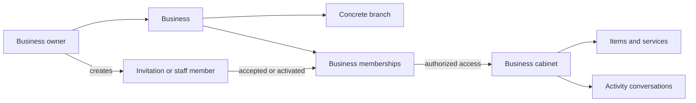

# Business flow

The customer sees the public business/branch presentation through catalog and search cards. Owners and staff see only the cabinet surfaces allowed by membership and branch access.

Do not treat a branch as the legal root, create another business for a staff member, or allow a business user to manually mark catalog setup complete.
