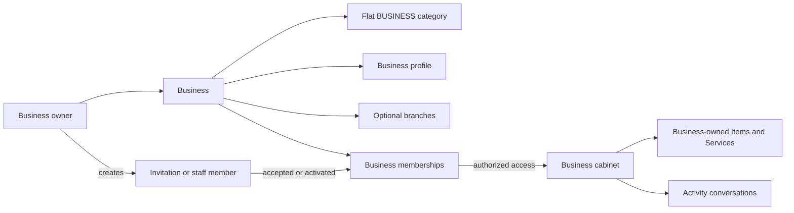

# Business flow

The customer sees the public business, optional branch, Item, and Service presentation through search cards. Owners and staff see only the cabinet surfaces allowed by membership and branch access.

Do not treat a branch as the legal root, create another business for a staff member, or require a branch before creating an Item or Service.
