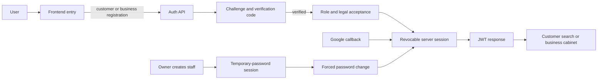

# Identity flow

The user sees a customer, business-owner, or staff entry path. The frontend receives a Bearer JWT and role/start-route context; it never receives a password hash or verification code.

Do not let staff self-register, treat an OAuth bridge cookie as a permanent session, or accept legal consent before the required verification and role choice.
