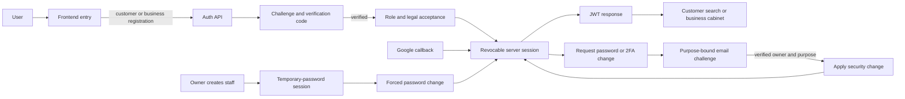

# Identity flow

The user sees a customer, business-owner, or staff entry path. The frontend receives a Bearer JWT and role/start-route context; it never receives a password hash or verification code.

An authenticated password or two-factor change is never applied by its request call. The request stages the intent and sends a code; confirmation validates the authenticated owner, purpose, code, and staged payload before applying it. Password confirmation revokes other sessions but preserves the session that performed the change.

Do not let staff self-register, treat an OAuth bridge cookie as a permanent session, or accept legal consent before the required verification and role choice.
