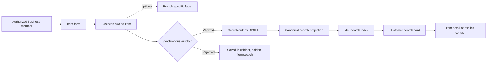

# Item flow

The business user sees Item CRUD and enabled/disabled state immediately after creation. A normal enabled Item is approved and published in the same create flow. An autobanned Item is still persisted and visible to the business but is excluded from search. Branch-specific price and location are shown only when known.

Do not expose disabled/deleted items in search, add stock or availability claims not present in canonical data, or let AI mutate canonical Item facts.
