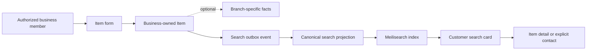

# Item flow

The business user sees Item CRUD and enabled/disabled state. The customer sees an enabled Item when its publication rules are satisfied; branch-specific price and location are shown only when known.

Do not expose disabled/deleted items in search, add stock or availability claims not present in canonical data, or let AI mutate canonical Item facts.
