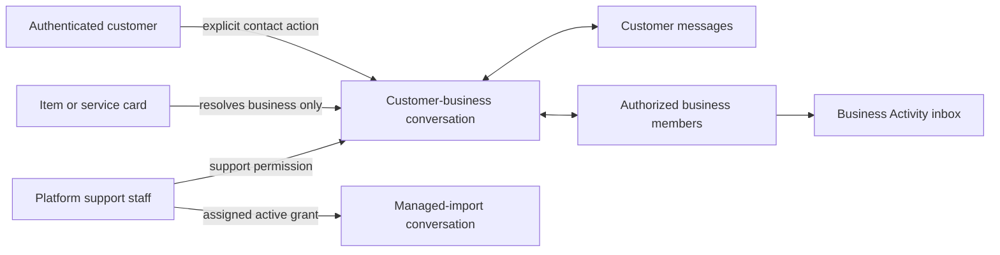

# Messaging flow

The customer sees a chat only after a real interaction; business members see their shared business-side history and unread state. Files are limited to conversation participants and validated managed-import access.

Do not create a conversation during search, identify a conversation by branch or offer, or expose conversations to a platform member without the permission required for that conversation type.
