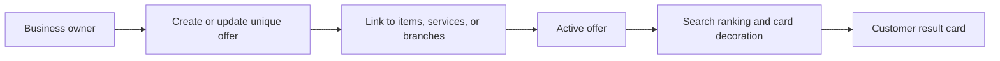

# Unique offers flow

The business user sees offer lifecycle and linked item/service objects. The customer sees a discount label/effective price or a non-discount brand label; the internal score boost is never rendered.

Do not turn a unique offer into a standalone search result, a buy-box comparison, or a public trust score.
