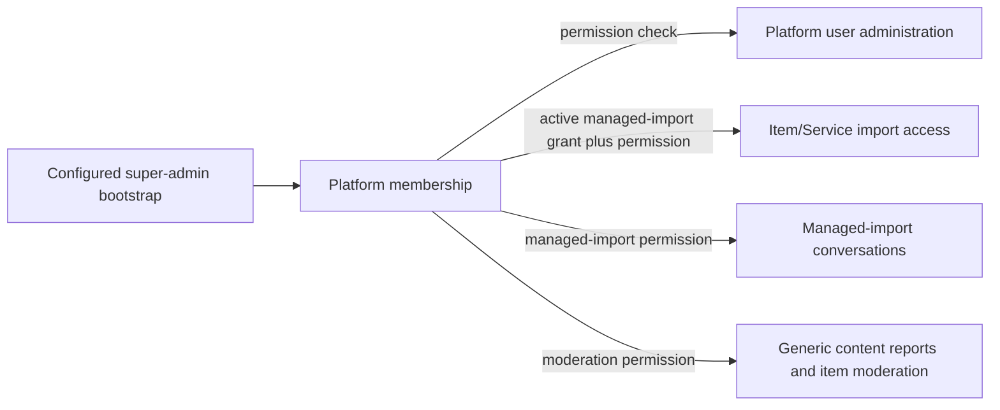

# Platform flow

Platform users see only the cabinet surface enabled by explicit permissions. Item/Service editing additionally needs an active managed-import grant for the target business; role alone is never enough.

Do not infer permission from platform role, give platform staff access to general customer-business chat, or allow AI enrichment without the dedicated platform permission.
