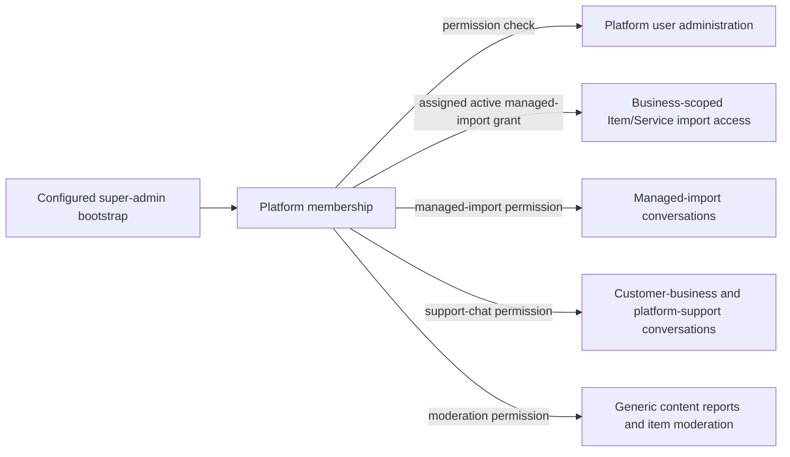

# Platform flow

Platform users see only the cabinet surface enabled by explicit permissions. Item/Service editing is the exception: activation creates a business-scoped, seven-day entitlement for the assigned platform member, and no global edit flag opens other businesses.

Do not infer business catalog access from platform role, extend a managed-import grant to another business, or allow managed-import chat access after grant expiry.
