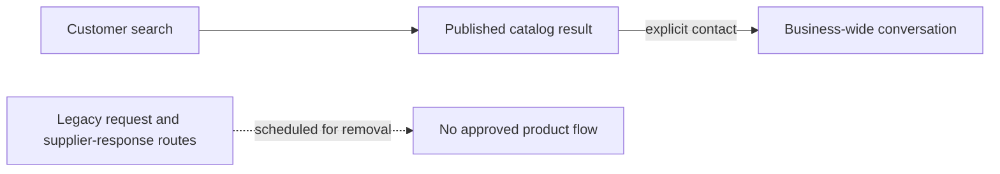

# Retired request flow

The approved user flow has no fallback request or supplier broadcast. A customer contacts a matching business through an explicit conversation action.

Do not restore request creation from search, reuse retired request code for the business inbox, or treat legacy endpoint references as product approval.
