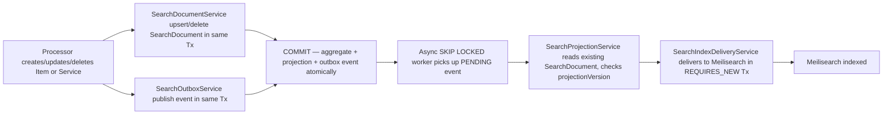

# Search flow

## Write path

Key invariant: the SearchDocument is created/updated/deleted synchronously with the canonical aggregate. The worker only reads and delivers — it never creates SearchDocuments.

## Read path

```mermaid
flowchart LR
    U[Customer] --> F[Frontend selects item or service scope]
    F --> Q[POST search with raw query]
    Q --> I[Query interpretation within fixed scope]
    I --> M[Meilisearch bounded candidates by aggregateId]
    M --> H[PostgreSQL hydration via SearchDocument]
    H --> O[Overlay dirty projections — read-your-writes]
    O --> R[Deterministic ranking and sections]
    R --> C[Exact and explicitly relaxed cards]
    M -. unavailable .-> P[PostgreSQL indexed fallback]
    P --> H
```

The customer sees the raw query context, fixed scope, Item/Service cards, and clearly labelled relaxed alternatives. Diagnostics are operational data, not UI content.

Do not let AI switch scope, select a business, invent availability, create requests, chats, notifications, or supplier outreach. Search only returns Item/Service retrieval results.
