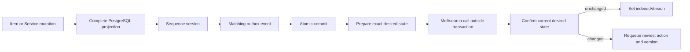

# Search flow

## Mutation and delivery

## Retrieval and presentation

```mermaid
flowchart LR
    U[Customer selects ITEM or SERVICE] --> Q[Raw query plus explicit filters]
    Q --> A[Optional DeepSeek query interpretation or regex fallback]
    A --> H[Single Meilisearch native hybrid search]
    H --> P[PostgreSQL hydration]
    P --> R[3-signal ranking: price penalty, city penalty, offer boost]
    R --> S[Section: exact or alternatives]
    S --> B[Public Business profile hydration]
    B --> C[Compact Item or Service row]
```

DeepSeek unavailability falls back to regex-based price extraction. Meilisearch unavailability returns an error to the client. AI cannot change mode, apply hard inferred constraints, select businesses, or invent availability.
