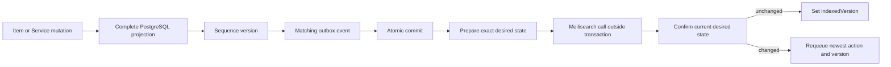
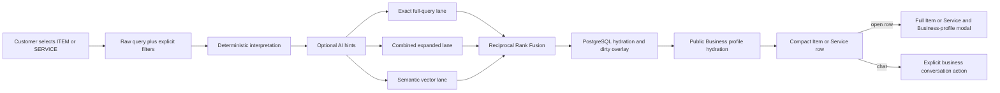

# Search flow

## Mutation and delivery

## Retrieval and presentation

Semantic failure preserves both lexical lanes. Full Meilisearch failure switches to bounded PostgreSQL lexical retrieval. AI cannot change mode, apply hard inferred constraints, select businesses, or invent availability.
