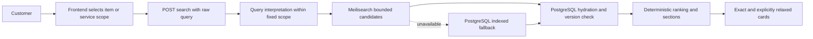

# Search flow

The customer sees the raw query context, fixed scope, catalog cards, and clearly labelled relaxed alternatives. Diagnostics are operational data, not UI content.

Do not let AI switch scope, select a business, invent availability, create requests, chats, notifications, or supplier outreach. Search only returns catalog retrieval results.
