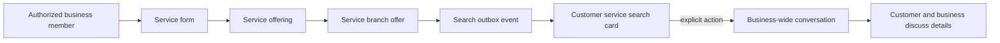

# Service flow

The customer sees service name, business/branch, known price or price-from, and known duration. Contact is explicit and opens/resumes the business-wide chat.

Do not model services as items, create a booking/calendar record from search, or present schedule text as a reservable slot system.
